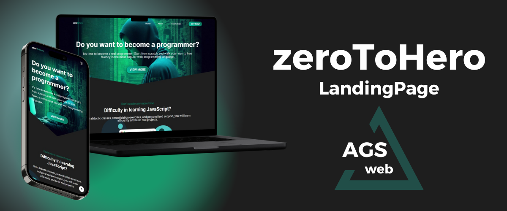

<h1 align="center">
    
</h1>

<h3 align="center">
  zeroToHero
</h3>

LandingPage</blockquote>

  <a href="https://zerotohero-landing.netlify.app">
    View Online
  </a>

## ⚙️ About this project

This is my first project published here on GitHub. I have only been programming for a few weeks, I am just starting now. This project is quite simple, it does not use any advanced programming tools or concepts..

### More info

- The project was built using only pure HTML, CSS, and JavaScript.

- Despite the project not being complex and being quite simple, it meets the need for a landing page. The design is well crafted and beautiful, the page flows in a logical way to lead the user to click on the CTA button.

- There is no excessive information, no unnecessary text cluttering the page, only what is necessary to pique the user's interest and address their doubts.

## ❗ Fictitious page

This page is fictitious and was developed solely for study purposes in order to include the project in my portfolio. ZeroToHero is not my course or brand, and any ZeroToHero that may actually exist is completely unrelated to my project.

## :memo: License

This project is under the MIT license. See the file [LICENSE](LICENSE.md) for more details.

---

Feito com ❤ e muito ☕ por AGS-WEB